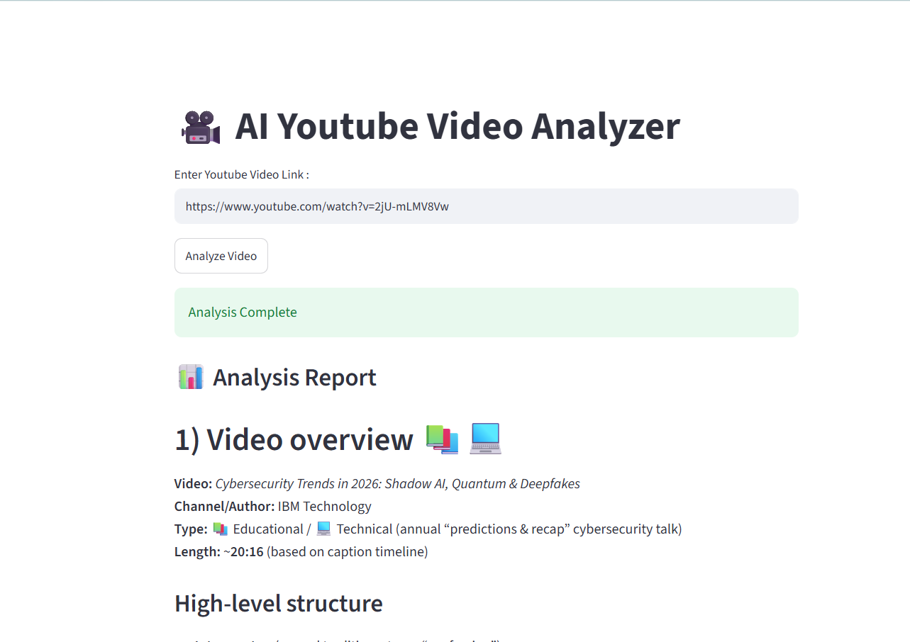

# AI YouTube Video Analyzer

AI YouTube Video Analyzer is a Streamlit application that analyzes a YouTube video and generates a structured report with a video overview, timestamp-based summaries, topic progression, key learning points, and practical takeaways.



## Features

- Analyze YouTube videos from a simple Streamlit interface.
- Generate a clear video overview with title, channel, type, and length.
- Create timestamped summaries for important topic transitions.
- Highlight main themes, learning points, and practical takeaways.
- Use transcript-aware analysis through Agno's YouTube tools.
- Render the final report directly in the browser using Markdown.

## Project Structure

```text
AI-Youtube-Analyzer/
|-- AGENTICAI/
|   |-- ui.py
|   `-- youtube_analyzer.py
|-- assets/
|   `-- sample_ui.png
`-- README.md
```

## Tech Stack

- Python
- Streamlit
- Agno
- OpenAI Responses API
- YouTube transcript tooling
- python-dotenv

## Prerequisites

Before running the app, make sure you have:

- Python 3.10 or newer installed
- A valid OpenAI API key
- Internet access for YouTube transcript retrieval and model responses

## Installation

Clone the repository:

```bash
git clone https://github.com/LikithaKodidela/AI-Youtube-Analyzer.git
cd AI-Youtube-Analyzer
```

Create and activate a virtual environment:

```bash
python -m venv .venv
```

On Windows:

```bash
.venv\Scripts\activate
```

On macOS or Linux:

```bash
source .venv/bin/activate
```

Install dependencies:

```bash
pip install streamlit python-dotenv agno openai youtube-transcript-api
```

## Environment Variables

Create a `.env` file in the project root:

```env
OPENAI_API_KEY=your_openai_api_key_here
```

The app loads environment variables with `python-dotenv`.

## How To Run

Start the Streamlit app:

```bash
streamlit run AGENTICAI/ui.py
```

Then open the local Streamlit URL shown in the terminal, usually:

```text
http://localhost:8501
```

## How To Use

1. Paste a YouTube video URL into the input box.
2. Click `Analyze Video`.
3. Wait while the agent retrieves available video information and transcript data.
4. Review the generated analysis report in the app.

## Example Prompt Sent To The Agent

The UI sends the entered video URL to the agent using this format:

```text
Analyze this YouTube video: <video_url>
```

The analyzer is instructed to produce:

- Video overview
- Timestamped segments
- Topic grouping
- Key learning points
- Practical demonstrations or references when available

## Timestamp Support

The analyzer uses:

```python
YouTubeTools(languages=["en", "en-US"])
```

This language order helps videos with a general English transcript (`en`) return usable captions before trying regional English (`en-US`). This is important because some videos do not provide an `en-US` transcript even when an English transcript exists.

## Troubleshooting

### Timestamps are missing

If the report does not include timestamps, the most common reason is that the video transcript is unavailable, disabled, or only available in a language not listed in `youtube_analyzer.py`.

Try updating the language list:

```python
YouTubeTools(languages=["en", "en-US", "hi"])
```

### OpenAI API key error

Confirm that your `.env` file exists and includes:

```env
OPENAI_API_KEY=your_openai_api_key_here
```

### Streamlit command not found

Install Streamlit inside your active virtual environment:

```bash
pip install streamlit
```

## Main Files

### `AGENTICAI/ui.py`

Contains the Streamlit user interface. It collects the YouTube URL, calls the analyzer agent, and displays the generated Markdown report.

### `AGENTICAI/youtube_analyzer.py`

Builds the Agno agent, configures the OpenAI model, enables YouTube transcript tools, and defines the instructions for producing detailed video analysis.

## Future Improvements

- Add a `requirements.txt` file for easier installation.
- Add URL validation before running the agent.
- Add support for selecting transcript language from the UI.
- Export analysis reports as Markdown or PDF.
- Add a history section for previously analyzed videos.

## License

No license has been added yet. Add one before using or sharing this project publicly beyond personal or educational use.
